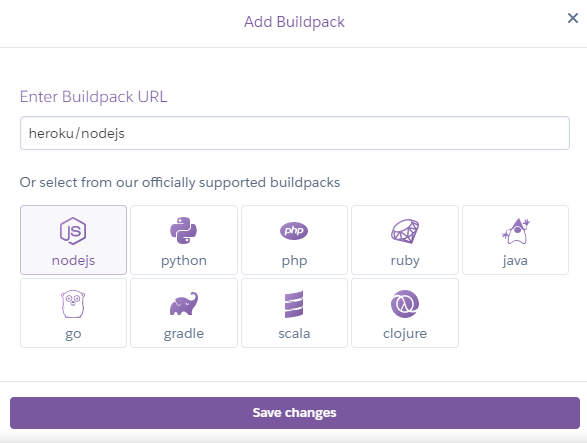
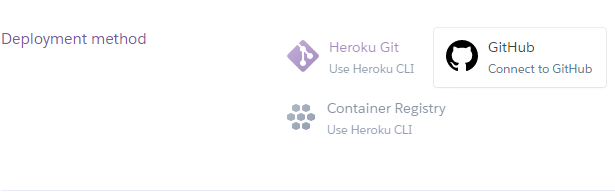
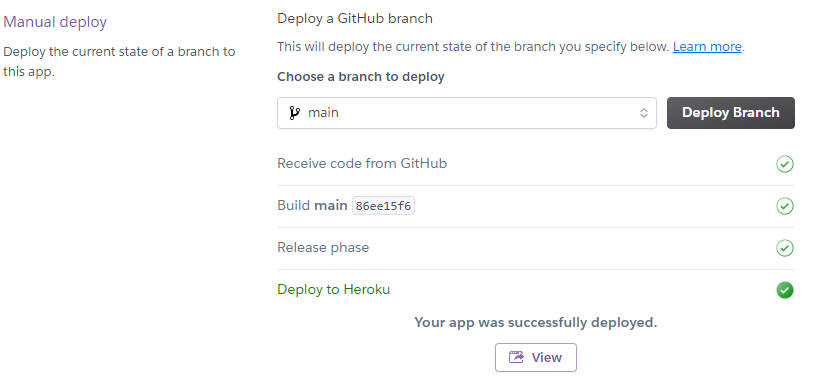

Hello there and welcome to the quiz that advices the best for your lifestyle!
## [Pet Game Quiz](https://pet-game-quiz.herokuapp.com/)
by Wanda Molineros

Do you find yourself in need of some companionship in your life from a fury friend but not sure if your current lifestyle is cut out for it?
Well, this is the best quiz to allow you to figure these questions out.

Over Covid, many people adopted or bought pets without considering the possibility of one day returning to the office full time. After the pandemic,
shelters experienced an influx of dogs for instance. People did not properly assess whether their lifestyle outside of the pandemic would be able 
to handle a fury companion. In order to assess this for yourself moving forward, this quiz will take you through a couple of statements in which 
the user will answer 'yes' or 'no' and provide details as to whether they require more of a low or high maintentance pet.

## Contents
* Backend overview and tools
* Game Logic
* Overview of the site: Contents
     + Play
     + Discontinue
     + Restart
     + Advice and Scores
* Credits
* Testing and errors identified
* Deployment
* Images 

### Backend overview and tools

Python was the backend code used and it is a command-line buit application. The tools used include the following:

- [Github](https://github.com/): Code version control
- [Gitpod](https://gitpod.io/workspaces)
- [Heroku](https://heroku.com/)
- [Lucid chart](https://lucid.app/documents#/dashboard)
- [Google sheets](https://docs.google.com/spreadsheets/u/0/)
- [Google cloud](https://console.cloud.google.com/)

### Game Logic

The game logic that I used began from the welcome message and led the user to steps 1-4.

### Overview of the site

The basic overview consisted of options 1-4. The first option allows the user to play the game, leading them to add their name and if added correctly, progresses them to the statements to answer. The second option, allows the user to discontinue the game and gives them a goodbye message. The third option, gives the user the ability to restart the game. In the future, I hope to add the feature to resart or discontinue within the game itself so that the user is able to discontinue the game whenever require.

### Credits 

Initially I began working on a trimester counter, that allowed the user to check their monthly progression throughout their pregnancy. However, this did not work too well for me as I didn't see the best way to command the prompt. I decicided to change my project during a walk with my dog and thinking how I couldn't have had him about a year ago as my lifestyle and circumstances were different. This train of thought led me to creating a quiz that would allow someone who wants a pet to acknowledge whether a low maintenance or high maintenance pet would be best for them. I started off with suggestions from the Love Sandwiches run through but couldn't apply this too well to my own project so I searched for a project that was closer to my idea and landed on Snakequiz. I applied a large part of my code to be similar but with my own idea in mind. The following deserve major credit to my work:

* [Code Institute's Love Sandwiches](https://learn.codeinstitute.net/courses/course-v1:CodeInstitute+LS101+2021_T1/courseware/293ee9d8ff3542d3b877137ed81b9a5b/071036790a5642f9a6f004f9888b6a45/?child=last)

* [Snakequiz](https://snakequiz-pp3.herokuapp.com/)

## Testing and errors identified

Testing was completed on PEP8.

### Error correction

## Deployment

Deployment was completed on [Heroku](https://id.heroku.com/login) through their free account. I selected to create a new account and then once confirmed, I created a new app. I typed in the name of the new app and began the deployment process within the settings. I needed to add the Config Vars and CREDS.json file. Then I selected Github and selected the 'deploy' tab'. I chose 'Manual deploy' as recommended by the 'Love Sandwiches' project. Finally, I was able to deploy my sight.

[Pet Game Quiz](https://pet-game-quiz.herokuapp.com/) was created by Wanda Molineros. This page was last edited on 14 Sep 2022, at 10:45 (GMT).